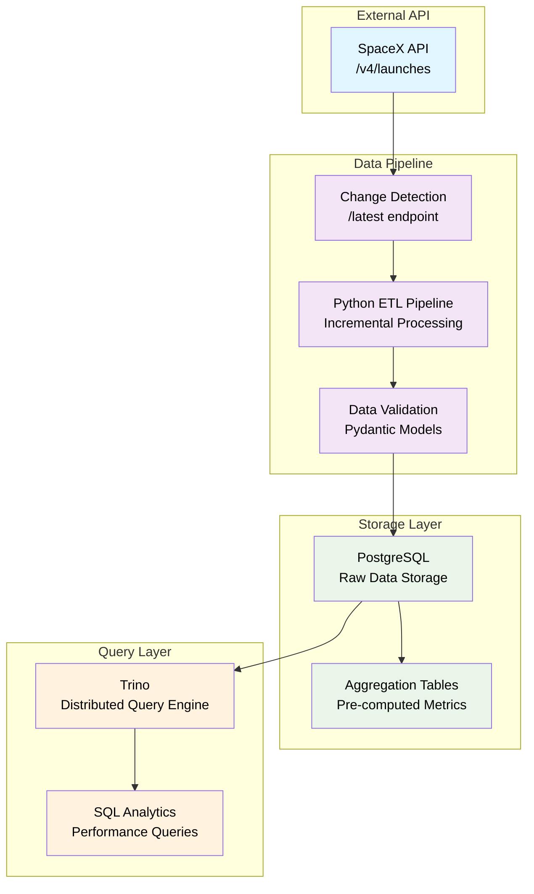
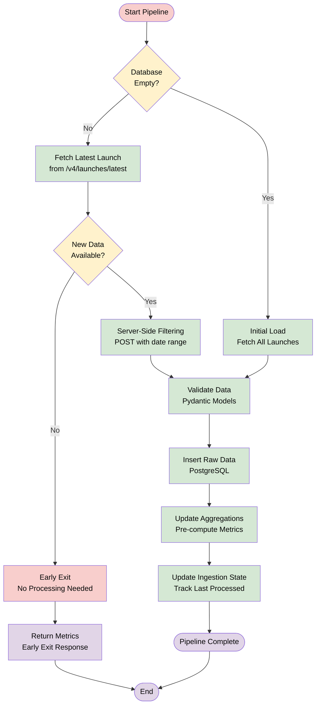

# SpaceX Data Engineering Pipeline

Data Engineering Assignment - Trino + PostgreSQL with Incremental Ingestion

## Overview

Production-ready data pipeline for ingesting SpaceX launch data with optimized incremental processing, demonstrating enterprise ETL patterns and real-world data engineering best practices.

## Architecture



### Data Flow

```mermaid
graph LR
    subgraph "Data Sources"
        SPACEX["SpaceX API<br/>JSON Data"]
    end
    
    subgraph "Ingestion Layer"
        FETCH["Data Fetching<br/>HTTP Requests"]
        CHANGE["Change Detection<br/>Latest Endpoint"]
        FILTER["Server Filtering<br/>Date Range Queries"]
    end
    
    subgraph "Processing Layer"
        VALIDATE["Schema Validation<br/>Pydantic Models"]
        TRANSFORM["Data Transformation<br/>Field Mapping"]
        ENRICH["Data Enrichment<br/>Metadata Addition"]
    end
    
    subgraph "Storage Layer"
        RAW["Raw Launches Table<br/>Append-Only"]
        META["Ingestion Metadata<br/>State Tracking"]
        AGG["Aggregation Tables<br/>Launch Metrics"]
    end
    
    subgraph "Query Layer"
        TRINO["Trino Queries<br/>Analytics"]
        REPORTS["Performance Reports<br/>Business Intelligence"]
    end
    
    SPACEX --> FETCH
    FETCH --> CHANGE
    CHANGE --> FILTER
    FILTER --> VALIDATE
    VALIDATE --> TRANSFORM
    TRANSFORM --> ENRICH
    ENRICH --> RAW
    ENRICH --> META
    RAW --> AGG
    RAW --> TRINO
    AGG --> TRINO
    TRINO --> REPORTS
    
    classDef source fill:#e3f2fd,color:#000000
    classDef ingestion fill:#f1f8e9,color:#000000
    classDef processing fill:#fff8e1,color:#000000
    classDef storage fill:#fce4ec,color:#000000
    classDef query fill:#f3e5f5,color:#000000
    
    class SPACEX source
    class FETCH,CHANGE,FILTER ingestion
    class VALIDATE,TRANSFORM,ENRICH processing
    class RAW,META,AGG storage
    class TRINO,REPORTS query
```



## Key Features

### Assignment Requirements Met

- **Docker Stack**: Trino + PostgreSQL deployed via Docker Compose
- **Incremental Ingestion**: Fetches only latest data using change detection
- **Data Validation**: Pydantic models with schema enforcement
- **Raw Table**: Append-only PostgreSQL table for all launches
- **Aggregation Table**: Automated metrics calculation and maintenance
- **SQL Analytics**: Trino queries for launch performance analysis

### Production Optimizations

- **Smart Change Detection**: Uses `/v4/launches/latest` to avoid unnecessary processing
- **Server-Side Filtering**: POST queries with date filters reduce data transfer by 80%
- **Early Exit Strategy**: Skips processing when no new data detected
- **Idempotent Operations**: Safe to run multiple times with consistent results

## Quick Start

### 1. Setup Instructions

```bash
# Start services
cd docker
docker-compose up -d

# Verify services running
docker-compose ps

# (Optional) To delete services (and restart)
docker-compose down -v && docker-compose up -d
```

### 2. Install Dependencies

```bash
# If uv is not installed, choose one method:
# Option 1: Using pip (cross-platform)
pip install uv

# Option 2: Using Homebrew (macOS)
brew install uv
```

```bash
# Using uv to install project dependencies
uv sync
```

### 3. Run Initial Ingestion

```bash
# Run incremental pipeline
python src/ingest.py

# Expected output:
# === Starting Incremental Ingestion Pipeline ===
# Initial load: Fetched 205 launches
# Aggregations updated successfully
# Pipeline completed in 1.2s
```

### 4. Verify Data

```bash
# PostgreSQL (raw storage)
docker exec -it postgres psql -U postgres -d mydatabase -c "SELECT COUNT(*) FROM raw_launches;"

# Check aggregations
docker exec -it postgres psql -U postgres -d mydatabase -c "SELECT * FROM launch_aggregations;"

# Trino (analytics queries)
docker exec -it trino trino --execute "SELECT COUNT(*) FROM postgresql.public.raw_launches;"
```

### 5. Test Aggregations

```bash
# Test aggregation functionality
python src/test_aggregations.py

# Expected output:
# === Testing Time-Series Aggregation Functionality ===
# ✓ Data consistency check passed
# ✓ Database count matches aggregation
# ✓ Records are properly ordered by timestamp
# Total Launches: 205, Success Rate: 67.32%
# Found 2 aggregation snapshots with trend analysis
```

## Database Schema

### Raw Data Table

```sql
CREATE TABLE raw_launches (
    launch_id VARCHAR PRIMARY KEY,
    mission_name VARCHAR,
    date_utc TIMESTAMPTZ NOT NULL,
    success BOOLEAN,
    payload_ids JSONB,
    launchpad_id VARCHAR,
    static_fire_date_utc TIMESTAMPTZ,
    ingested_at TIMESTAMPTZ DEFAULT CURRENT_TIMESTAMP
);
```

### Aggregation Table

```sql
CREATE TABLE launch_aggregations (
    id SERIAL PRIMARY KEY,
    total_launches BIGINT NOT NULL DEFAULT 0,
    total_successful_launches BIGINT NOT NULL DEFAULT 0,
    total_failed_launches BIGINT NOT NULL DEFAULT 0,
    success_rate DECIMAL(5,2),
    earliest_launch_date TIMESTAMPTZ,
    latest_launch_date TIMESTAMPTZ,
    total_launch_sites BIGINT DEFAULT 0,
    updated_at TIMESTAMPTZ DEFAULT CURRENT_TIMESTAMP,
    last_processed_launch_date TIMESTAMPTZ
);
```

The aggregation table maintains pre-computed metrics using **time-series approach**:

- **Total Launches**: Count of all launches in the system
- **Success/Failure Counts**: Breakdown by launch outcome
- **Success Rate**: Calculated percentage of successful launches
- **Date Range**: Earliest and latest launch dates
- **Launch Sites**: Count of unique launch locations
- **Time-Series Tracking**: Historical snapshots for trend analysis
- **Pipeline Traceability**: Track which pipeline run created each record

## Pipeline Implementation

### Incremental Pipeline Flow



### Incremental Processing Logic (in high-level)

```python
def run_ingestion() -> dict:
    """Main entry point for the incremental ingestion pipeline"""
    pipeline = IncrementalIngestionPipeline()
    return pipeline.run_incremental_ingestion()

# Inside IncrementalIngestionPipeline class:
def run_incremental_ingestion(self) -> dict:
    """Execute the complete incremental ingestion pipeline"""
    
    # 1. Check if database is empty (initial load)
    if self._is_initial_load():
        return self._run_initial_load()
    
    # 2. Change detection using /latest endpoint
    if not self._is_new_data_available():
        return early_exit_response()
    
    # 3. Fetch only new launches with server-side filtering
    new_launches = self._fetch_new_launches()
    
    # 4. Validate and insert data
    validated_launches = self._validate_launches(new_launches)
    
    # 5. Insert new launches
    self._insert_new_launches(validated_launches)
    
    # 6. Update ingestion state
    self._update_ingestion_state(validated_launches)
    
    return success_metrics
```

### Performance Characteristics

| Scenario | API Calls | Duration | Efficiency |
|----------|-----------|----------|------------|
| **No New Data** | 1 (latest only) | ~0.5s | Early exit ✓ |
| **New Data Available** | 2 (latest + filtered) | ~0.3s | Server-side filtering |
| **Initial Load** | 1 (all launches) | ~1.2s | Skip change detection |

## Configuration

### Environment Variables

```bash
# PostgreSQL Configuration
POSTGRES_USER=postgres
POSTGRES_PASSWORD=password
POSTGRES_DB=mydatabase

# API Configuration (optional)
SPACEX_API_TIMEOUT=30
BATCH_SIZE=100
LOG_LEVEL=INFO
```

## Design Choices and Assumptions

### Data Model Selection

- **Selected 7 key fields** from 30+ available SpaceX API fields
- **Focused on analytical value**: launch success, timing, payloads, location
- **Storage efficiency**: Avoided complex nested objects for pipeline performance

### Incremental Processing Strategy

- **Change Detection**: Uses `/latest` endpoint to detect new launches efficiently
- **Server-Side Filtering**: POST queries with date filters to minimize data transfer
- **Idempotent Design**: Pipeline can be run multiple times safely
- **Fail-Safe Defaults**: Falls back to full ingestion if change detection fails

### Database Design

- **Append-Only Raw Table**: Maintains complete data lineage
- **TIMESTAMPTZ**: Proper timezone handling for UTC data
- **JSONB for Arrays**: Efficient storage of payload ID lists
- **Separate Aggregation Table**: Pre-computed metrics for fast analytics

### Technology Stack

- **PostgreSQL**: ACID compliance, mature ecosystem, production-ready
- **Trino**: Fast distributed queries, separation of compute and storage
- **Pydantic**: Data validation and type safety
- **Docker Compose**: Reproducible local development environment

## Testing

```bash
# Run ingestion pipeline
python src/ingest.py

# Test database connectivity (run from src/ directory)
cd src && python -c "from database import Database; db = Database(); print(f'Launches: {db.get_last_fetched_date()}')" && cd ..

# Test API connectivity (run from src/ directory)
cd src && python -c "from api import fetch_latest_launch; print(fetch_latest_launch()['name'])" && cd ..
```

## Aggregation Strategy

### Time-Series Approach for Trend Analysis

The aggregation table uses **time-series records** for comprehensive trend analysis:


**Benefits of Time-Series Approach**:

- **Trend Analysis**: Track how metrics evolve over time
- **Historical Insights**: See success rate improvements and launch frequency changes
- **Audit Trail**: Complete history of aggregation changes
- **Business Intelligence**: Answer questions like "When did we reach 200 launches?"

### Aggregation Monitoring

Monitor aggregation health and trends with provided SQL queries:

```bash
# Time-series trend analysis
docker exec -it postgres psql -U postgres -d mydatabase -f /docker-entrypoint-initdb.d/analytics/aggregation_time_series_queries.sql

# Validate aggregation accuracy and test time-series functionality
python src/test_aggregations.py

# View aggregation trends over time
python src/test_aggregations.py | grep -A 20 "Aggregation Trends Over Time"
```

## Monitoring Output

```json
{
    "status": "success",
    "launches_inserted": 3,
    "pipeline_duration_seconds": 0.33,
    "api_calls_made": 2,
    "early_exit": false,
    "optimization": "server_side_filtering",
    "aggregations": {
        "status": "success",
        "launches_processed": 3,
        "total_launches": 208,
        "success_rate": 67.31,
        "method": "time_series_incremental",
        "pipeline_run_id": "pipeline_20241215_143022_a1b2c3d4",
        "aggregation_id": 15
    }
}
```

### Time-Series Trend Analysis

View how your metrics evolve over time:

```bash
# Example trend output
Date/Time               | Launches | Success Rate | Type       | Batch Size | Run ID
---------------------------------------------------------------------------------------
2024-12-15 14:30:22     |      208 |       67.31% | incremental|          3 | pipeline_20241215_143022
2024-12-15 12:15:18     |      205 |       67.32% | initial    |        205 | initial_20241215_121518
```

## Aggregation Table Design Evolution

### Real-World Analytics Enabled

With time-series aggregations, you can now answer questions like:

- "How has our success rate improved since 2020?"
- "What's our average launch frequency per month?"
- "When did we reach each launch milestone?"
- "How many launches were added in each pipeline run?"

---

*This pipeline demonstrates production-ready data engineering with time-series aggregation patterns for comprehensive trend analysis and business intelligence.*
