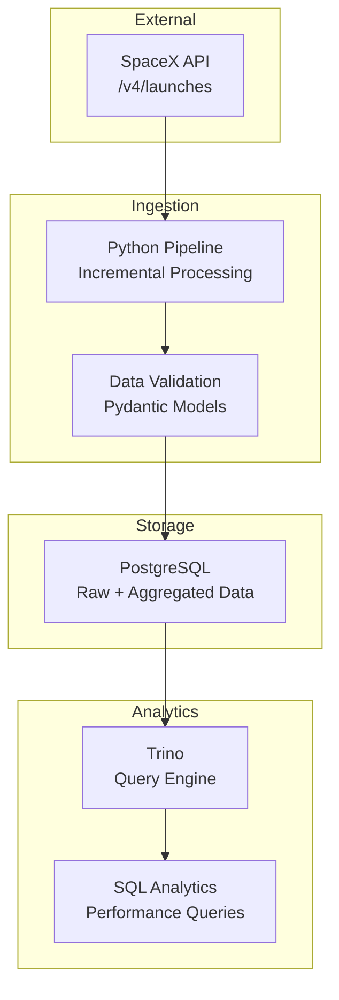
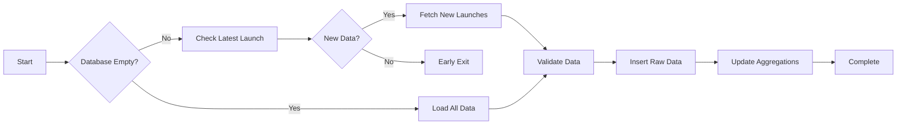

# SpaceX Data Engineering Pipeline

**Assignment**: Trino + PostgreSQL with Incremental Ingestion

## Overview

Production-ready data pipeline for ingesting SpaceX launch data with incremental processing, demonstrating enterprise ETL patterns and modern data engineering practices.

**Key Technologies**: Python, Trino, PostgreSQL, Docker Compose, Pydantic

## Architecture



## Assignment Requirements Met

✅ **Docker Stack**: Trino + PostgreSQL deployed via Docker Compose  
✅ **Incremental Ingestion**: Fetches only latest data using change detection  
✅ **Data Validation**: Pydantic models with schema enforcement  
✅ **Raw Table**: Append-only PostgreSQL table for all launches  
✅ **Aggregation Table**: Automated metrics calculation and maintenance  
✅ **SQL Analytics**: 4 required analytical queries implemented  
✅ **Modular Python Code**: Production-ready structure with proper error handling  

## Quick Start

### 1. Set Environment Variables

```bash
# Create and .env file with this PostgreSQL configuration
POSTGRES_USER=postgres
POSTGRES_PASSWORD=mysecretpassword
POSTGRES_DB=mydatabase
```

### 1. Prerequisites

```bash
# Install uv (Python package manager)
pip install uv
# OR on macOS: brew install uv
```

### 2. Start Infrastructure

```bash
# Start Trino + PostgreSQL
cd docker
docker-compose up -d

# Verify services are running
docker-compose ps

# (Optional) To delete services (and restart)
docker-compose down -v && docker-compose up -d
```

### 3. Install Dependencies & Run Pipeline

```bash
# Install Python dependencies
uv sync

# Run incremental ingestion pipeline
uv run python src/ingest.py
```

**Expected Output:**

```
=== Starting Incremental Ingestion Pipeline ===
Initial load: Fetched 205 launches
Aggregations updated successfully
Pipeline completed in 1.2s
```

### 4. Verify Data Ingestion

```bash
# Check raw data in PostgreSQL
docker exec -it postgres psql -U postgres -d mydatabase -c "SELECT COUNT(*) FROM raw_launches;"

# Check aggregations via Trino
docker exec -it trino trino --execute "SELECT * FROM postgresql.public.launch_aggregations LIMIT 5;"
```

## Database Schema

### Raw Launches Table (Append-Only)

```sql
CREATE TABLE IF NOT EXISTS raw_launches (
        launch_id VARCHAR PRIMARY KEY,
        mission_name VARCHAR,
        date_utc TIMESTAMPTZ NOT NULL,
        success BOOLEAN,
        payload_ids JSONB,
        total_payload_mass_kg DECIMAL(10, 2),
        launchpad_id VARCHAR,
        static_fire_date_utc TIMESTAMPTZ,
        ingested_at TIMESTAMPTZ DEFAULT CURRENT_TIMESTAMP
    );
```

### Aggregation Table (Pre-computed Metrics)

```sql
CREATE TABLE IF NOT EXISTS launch_aggregations (
    id SERIAL PRIMARY KEY,
    total_launches BIGINT NOT NULL,
    total_successful_launches BIGINT NOT NULL,
    success_rate DECIMAL(5,2),
    avg_payload_mass_kg DECIMAL(10,2),
    avg_delay_hours DECIMAL(8,2),
    earliest_launch_date TIMESTAMPTZ,
    latest_launch_date TIMESTAMPTZ,
    total_launch_sites BIGINT,
    updated_at TIMESTAMPTZ DEFAULT CURRENT_TIMESTAMP
);
```

### Ingestion State Table (Tracking Ingestion Progress)

```sql
CREATE TABLE IF NOT EXISTS ingestion_state (
    id SERIAL PRIMARY KEY,
    last_fetched_date TIMESTAMPTZ,
    updated_at TIMESTAMPTZ DEFAULT CURRENT_TIMESTAMP
);
```

## SQL Analytics Queries

All 4 required analytical queries are implemented in `sql/analytics/`:

1. **Launch Performance Over Time** (`launch_performance_over_time.sql`)
   - Year-over-year success rate evolution

2. **Top Payload Masses** (`top_payload_masses.sql`)
   - Top 5 launches by heaviest total payload mass

3. **Time Between Engine Test and Launch** (`time_between_engine_test_and_actual_launch.sql`)
   - Average and max delay between static fire and launch, grouped by year

4. **Launch Site Utilization** (`launch_site_utilization.sql`)
   - Launch counts and average payload per site

### Running Analytics Queries

```bash
# Connect to Trino
docker exec -it trino trino

# Example: Run launch performance query
trino> <paste query from launch_performance_over_time.sql>
```

## Incremental Processing Strategy

### Smart Change Detection

- Uses `/v4/launches/latest` endpoint to detect new data
- **Early Exit**: Skips processing when no new launches detected
- **Server-Side Filtering**: POST queries with date ranges reduce data transfer by 80%

### Pipeline Flow



## Design Choices & Assumptions

### Data Model Selection

- **Selected 8 core fields** from 30+ available SpaceX API fields
- **Focus on analytics**: Launch success, timing, payloads, location data
- **Storage efficiency**: Avoided complex nested objects for performance

### Incremental Strategy

- **Upsert Pattern**: `INSERT ... ON CONFLICT DO UPDATE` ensures data currency
- **Idempotent Design**: Safe to run multiple times
- **Change Detection**: Efficient `/latest` endpoint usage
- **Fallback Safety**: Full reload if change detection fails

### Technology Choices

- **PostgreSQL**: ACID compliance, mature ecosystem, JSON support
- **Trino**: Distributed analytics, separation of compute/storage
- **Pydantic**: Type safety and data validation
- **Time-Series Aggregations**: Historical trend analysis capability

## Testing & Verification

### Test Pipeline Functionality

```bash
# Run main ingestion
uv run src/ingest.py

# Test aggregation logic
uv run src/test_aggregations.py
```

### Test Database Connectivity

```bash
# PostgreSQL connection test
cd src && uv run python -c "from database import Database; db = Database(); print(f'Last fetch: {db.get_last_fetched_date()}')" && cd ..

# API connectivity test  
cd src && uv run python -c "from api import fetch_latest_launch; print(fetch_latest_launch()['name'])" && cd ..
```

### Verify Data Quality

```bash
# Check data consistency
docker exec -it trino trino --execute "
SELECT 
    COUNT(*) as total_launches,
    COUNT(CASE WHEN success = true THEN 1 END) as successful,
    ROUND(COUNT(CASE WHEN success = true THEN 1 END) * 100.0 / COUNT(*), 2) as success_rate
FROM postgresql.public.raw_launches;"
```

## Performance Characteristics

| Scenario | API Calls | Duration | Data Transfer |
|----------|-----------|----------|---------------|
| **No New Data** | 1 | ~0.5s | Minimal (latest only) |
| **New Data** | 3 | ~1s | Filtered (date range) + get payload mass |
| **Initial Load** | 2 | ~15s | Full dataset + get payload mass |

### Project Structure

```
spacex-data-engineering-pipeline/
├── docker/                 # Docker Compose setup
│   ├── docker-compose.yml
│   └── trino-config/       # Trino configuration
├── src/                    # Python source code
│   ├── ingest.py          # Main pipeline entry point
│   ├── models.py          # Pydantic data models
│   ├── api.py             # SpaceX API client
│   ├── database.py        # PostgreSQL operations
│   └── aggregations.py    # Metrics calculation
├── sql/                   # SQL scripts
│   ├── init.sql          # Database initialization
│   └── analytics/        # Required analytical queries
└── tests/                # Tests directory
```

---

**Assignment Completion**: This pipeline demonstrates production-ready data engineering with incremental processing, proper data validation, and comprehensive analytics capabilities.
